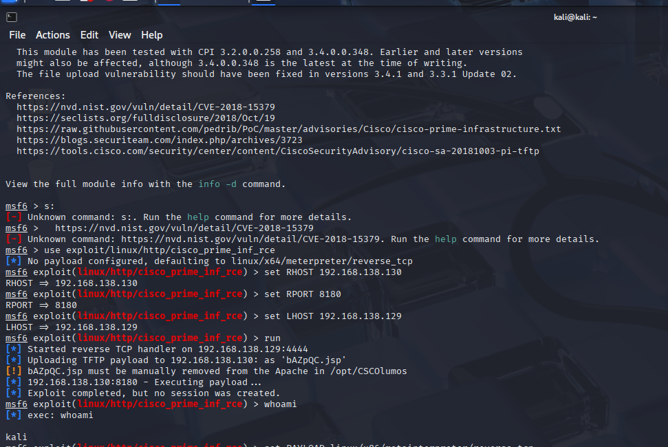

# Exploit 4: Cisco Prime Exploit on Metasploitable2 (CVE-2018-15379)

I began like usual by scanning the target using `nmap` and verified that tomcat (http) was running on port 8180.

I launched Metasploit in Kali Linux, set the target IP and port, and ran the `unix/http/cisco_prime_inf_rce` module. I set `RHOST` and `RPORT` to the target IP and port and `LHOST` to my Kali IP. the default payload was set to `linux/x64/meterpreter/reverse_tcp`.

The exploit ran, but no session was created.

This is because this exploit required a manual placement of the payload in `/opt/CSCOlumos`. Since this exploit is only partially automated, I did not get root access from the reverse shell.

I plan on revisiting manual exploitation soon.

**Shell Failed:**
