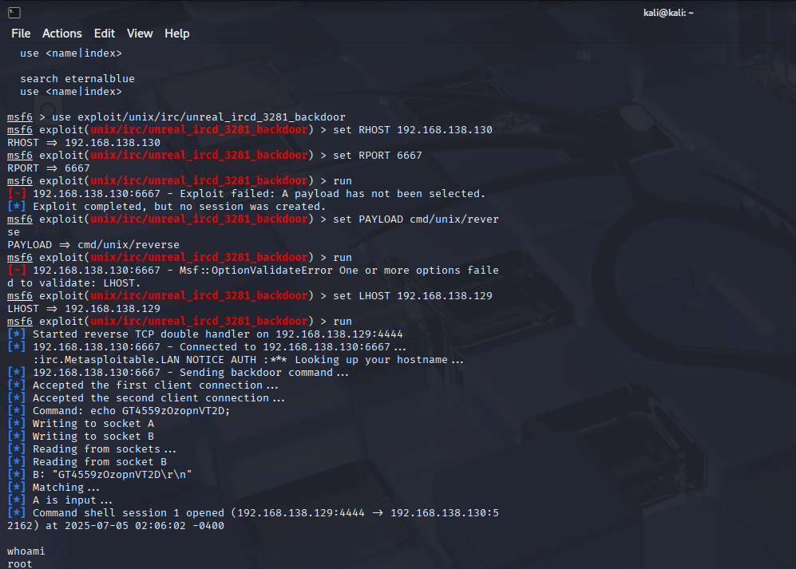

# Exploit 2: UnrealIRCd 3.2.8.1 Backdoor on Metasploitable2 (CVE-2010-2075)

I began by scanning the target using `nmap` and verified that UnrealIRCd was running on port 6667.

I launched Metasploit in Kali Linux, set the target IP and port, and ran the `unix/irc/unreal_ircd_3281_backdoor` module. I set `RHOST` and `RPORT` to the target IP and port. However, I couldn’t launch the exploit without a payload. I then selected the payload `cmd/unix/reverse`, but ran into another error because I didn’t set an `LHOST`, which is needed for a reverse shell. Once I set the `LHOST` to the IP of my Kali machine, the exploit succeeded and I got a command shell as root.

Once I had the shell, I ran `whoami` to verify access.

This second successful exploit gave me more practice with scanning, using Metasploit, and also introduced me to how payloads work.

**Shell Gained:**
