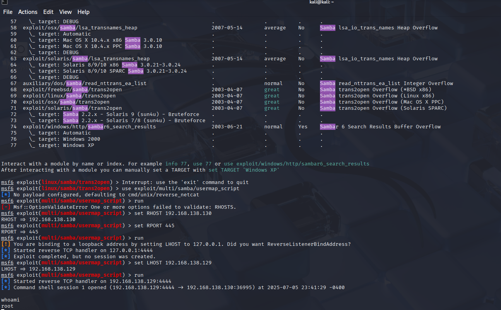

# Exploit 3: Samba Usermap Script Exploit on Metasploitable 2 (CVE-2007-2447)

I began by scanning my Kali machine again with `nmap` and saw that port 445 was open with a Samba service running.

I initially tried using the `exploit/linux/samba/trans2open` module, but it failed since Metasploitable 2 was running Samba version 3.0.20, which is not vulnerable to that exploit.

After searching again, I used the `exploit/multi/samba/usermap_script` module instead. This exploit targets a Samba configuration vulnerability via the `username map script` option. I used the default payload (`linux/x86/shell/reverse_netcat`), set `RPORT` to 445 (the default port used by SMB/Samba), and configured the correct `RHOST` and `LHOST`.

The exploit succeeded, and I was able to get a reverse shell. I verified I had root access using `whoami`.

**Shell Gained:**

