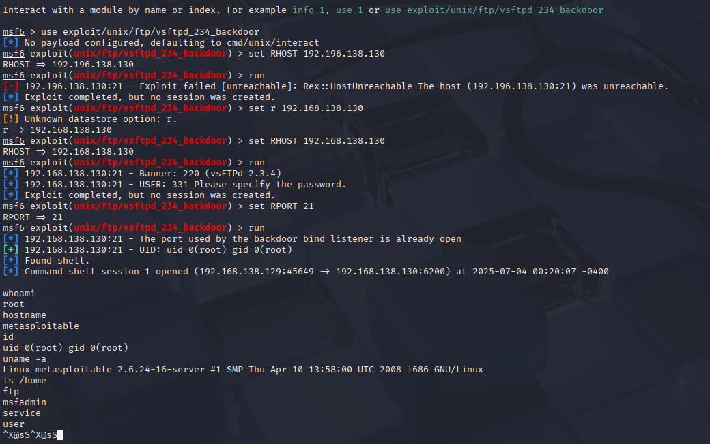

# Exploiting vsftpd 2.3.4 Backdoor on Metasploitable2

Today I used Metasploit to exploit a vulnerability in the vsftpd 2.3.4 service on Metasploitable2. After scanning the target with Nmap, I saw that port 21 was open and running the vulnerable version of vsftpd.

I launched Metasploit, set the target IP and port, and ran the `exploit/unix/ftp/vsftpd_234_backdoor` module. At first I got a connection error, but after correcting the IP and RPORT, the exploit succeeded and I got a command shell as root.

Once I had the shell, I ran a few basic commands like `whoami`, `uname -a`, and `hostname` to verify access.

This was my first successful exploit in my home lab. It helped me get comfortable with scanning, using Metasploit, and recognizing what a successful shell looks like.

