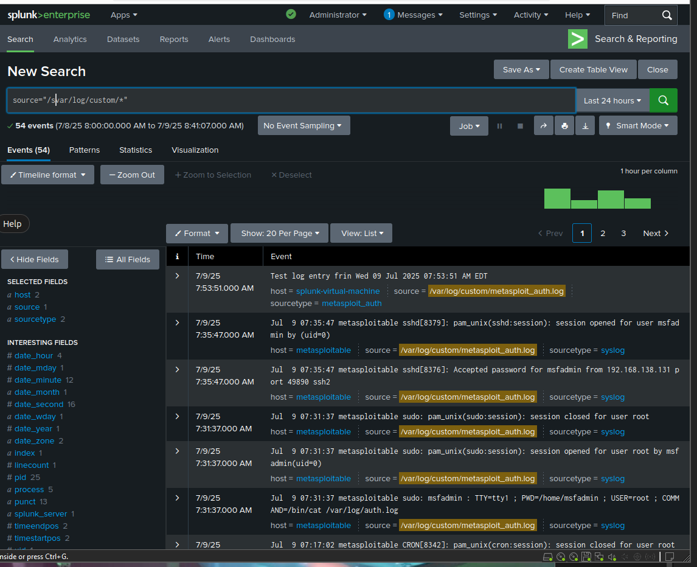

### Log Collection from Metasploitable2

- Pulled `/var/log/auth.log` from Metasploitable2 to a custom path on the Splunk VM.
- Used a custom bash script + SSH key authentication for secure log transfer.
- Indexed logs in Splunk and created a custom sourcetype `metasploit_auth`.
- Currently supports manual or cron-based pulling. Real-time ingestion still in progress.

**Auth Logs:**
