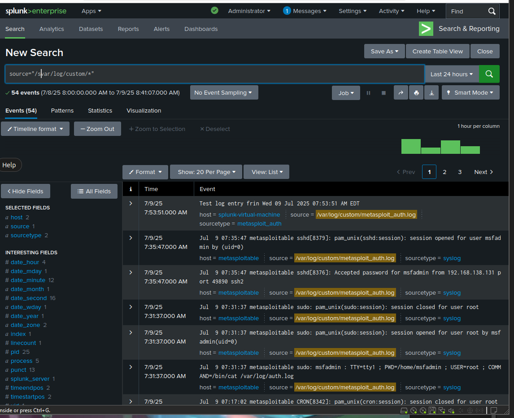

### Log Collection from Metasploitable2

- Pulled `/var/log/auth.log` from Metasploitable2 to a custom path on the Splunk VM.
- Used a custom bash script + SSH key authentication for secure log transfer.
- Indexed logs in Splunk and created a custom sourcetype `metasploit_auth`.
- Currently supports manual or cron-based pulling. Real-time ingestion still in progress.

**Auth Logs:**

## Difficulties

Configuring SSH key access was difficult, but used so that logs could be ingested from Metasploit automatically, without having to enter credentials. I generated an SSH key pair on my Splunk VM, and added the public key to Metasploitable. Had to modify Metasploitable's `sshd_config` file to make sure it could get the proper `/.ssh/authorized_keys` file.

I also had to resolve SSH compatibility issues, since my Splunk VM did not support RSA keys, i used `-oHostKeyAlgorithms=+ssh-rsa' to bypass host key negotiation errors.

I created a script to automate log ingestion: [pull_meta_logs.sh script](../ipts/pull_meta_logs.sh)

The scripted is automated via Cron Job to run every 5 minutes by using `crontab -e`.

Finally configured Splunk to monitor `/var/log/custom/*.log` and verified automatic log ingestion.

**Auto logs**
