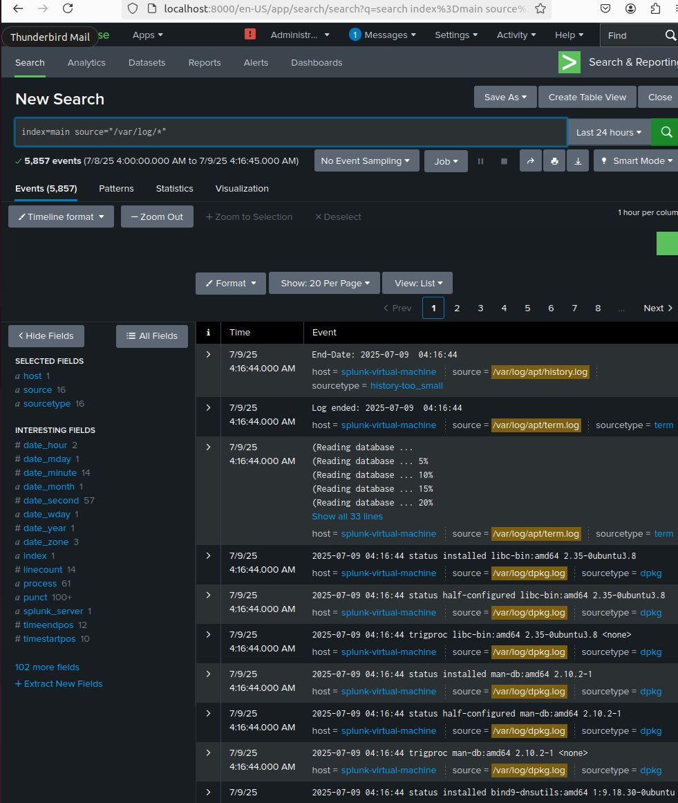

# Splunk SIEM Setup in Home Lab

## VM Environment
- **OS**: Ubuntu 22.04 LTS
- **Platform**: VMWare

## Splunk Install
1. **Download Splunk Enterprise Free Trial (.deb)**  
   From the [official Splunk website](https://www.splunk.com/en_us/download/splunk-enterprise.html).  
   I used the `.deb` installer for Linux.

2. **Install the Package**
   ```bash
   cd ~/Downloads
   sudo dpkg -i splunk-*.deb

3. **Start Splunk**

    ```bash
    sudo /opt/splunk/bin/splunk start --accept-license

4. **Login via Browser**

    Open `http://localhost:8000` and sign in with your admin credentials.

**Splunk Logs:**
