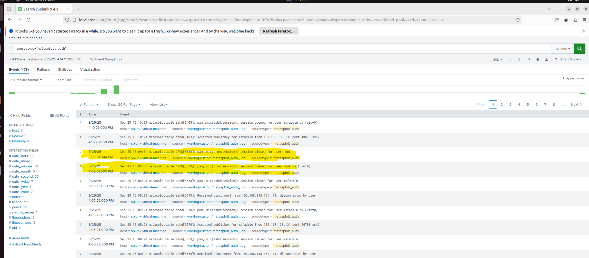

### Monitoring vsftpd-234-backdoor on Splunk

- Performed vsftod-234-backdoor on Metasploitable VM.
- Auth logs from metasploitable already configured to be sent to Splunk VM every 5 minutes via Cronjob.
- Indexed logs in Splunk and created a custom sourcetype `metasploit_auth`.

**Auth Logs:**

## Notes

- Unplanned session opened for root user, should be investigated.
- Should snapshot machines, isolate from network. Retrieve syslogs and cronjobs during this time, prioritize volatile data to investigate. Identify whether an incident has occured. 
- If incident has occured, such as remote ssh from backdoor, isolate machine and remove access, then recovre device.
- Document lessons learned.